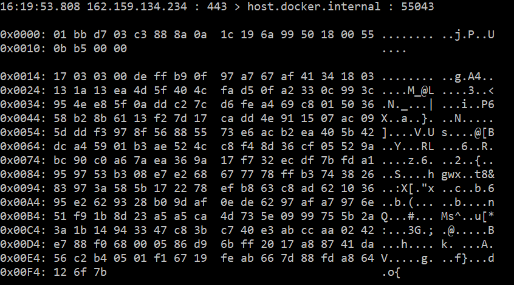

# Packet sniffer - IPK project 2 [ZETA]

* Author: **Juraj Lahvička**
* Subjcet: IPK project 2 2019/2020
* login: **xlahvi00**

# About

Packet sniffer catches packets flowing through specified interface and interprets them.

# How to run

1) **with make**
1.1. `make build`
1.1. `make run INTERFACE=XXXX`

where `XXXX` is name of interface to listen on.

2) **without make**
2.1. build the project (PacketSniffer.csproj) by `dotnet build`
2.1. `./ipk-sniffer -i interface [-p ­­port] [--tcp|-t] [--udp|-u] [-n num]`

where:
* `-i|--interface interface`      is an interface to listen on.
* `[-p|--port port]`              port to listen on.
* `[-t|--tcp]`                    resolve only _TCP_ packets
* `[-u|--udp]`                    resolve only _UDP_ packets
* `[-n|--number number]`          (Default 1). number of packets to resolve.

If `-t` and `-u` are *not* set both _TCP_ and _UDP_ packets are resolved.

# Example

`./ipk-sniffer -i any -p 443`

